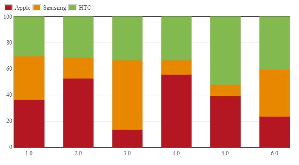
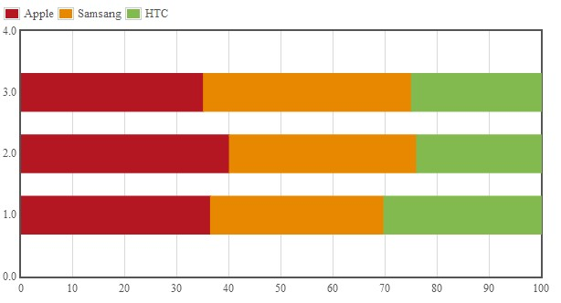
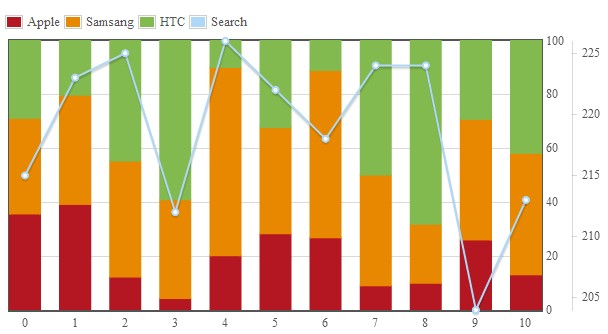

flot.stackpercent
=================

This is a plugin for jQuery flot, to create chart as stacked percentage.

This plugin is based on another plugin `jQuery.flot.stack.js` which can be found on <http://code.google.com/p/flot/>

Option to enable stackpercent:

```
series: {
    stackpercent: true
}
```
Here is a basic example's javascript code:
```javascript
$(function () {

	var data = [
		{"label":"Apple", "data": [[1,12], [2, 10], [3,2], [4,5], [5, 9], [6,11]], "color":"#B41722"},
		{"label":"Samsang", "data":[[1,11], [2, 3], [3,8], [4,1], [5, 2], [6,17]], "color":"#E78800"},
		{"label":"HTC", "data":[[1,10], [2, 6], [3,5], [4,3], [5, 12], [6,19]], "color":"#83BA4F"}
	];
	
	var options = {
        series: {
			stackpercent : true,    // enable stackpercent
            bars: {
				show: true,
				barWidth: 0.6,
				fillColor: {
					colors:[{opacity: 1},{opacity: 1}]
				},
				align: "center"
			}
        },
		legend : {
			container : "#legends",
			noColumns : 3
		},
        xaxis: {tickSize : 1},
        yaxis: {max:100}  // so the yaxis is from 0 to 100
    };
	
	$.plot($("#placeholder"), data, options);

});
```
It will create a chart like this:



And it can be horizontal:



You can disable a series's stackpercent by setting its own `stackpercent : null`, so you can display other type of charts with it.



You may need to set options `yaxis:{max:100}` to make the yaxis is 0-100.

It can work with another plugin called `flot.tooltip` <https://github.com/skeleton9/flot.tooltip> to easily show y value, percentage and x value.

See and try examples yourself.


jquery.flot.stackpercent is available under the MIT license.
